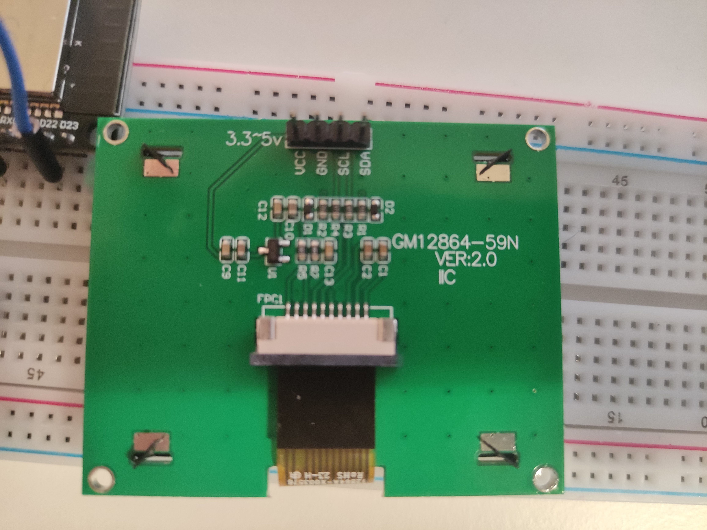
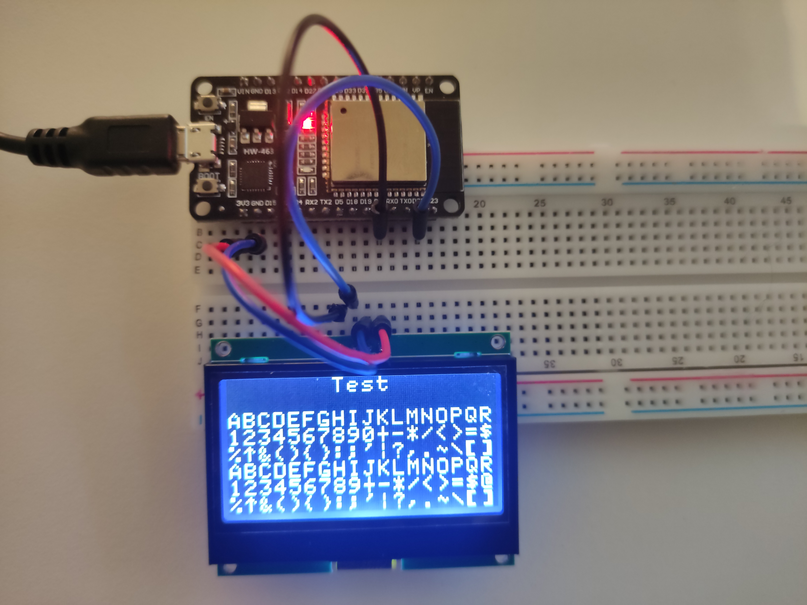

# LCD ST7567S 128X64 I2C with ESP32
If you have similar problams as I had, i.e. not able to control the LCD ST7567S device using I2C on ESP32 microcontroller, then this repo might help you :)
In my case, I have used GM12864-59N V2 LCD device in combination with the ESP-wroom-32, connected via serial port (I2C), voltage 3.3V.

My LCD device:
 

Example of a wiring:
 

Library code is borowed from the follwoing repos (and slightly updated):
https://github.com/mworkfun/ST7567A_128X32DOT_LCD
and
https://github.com/luetee/ST7567S_128X64_I2C

## What is working 
 - there is a support for basic letters and characters, and only one font size at the momment (size 7x8 px)
  - additional font sizes could be added, but that will require a lot of refactoring since LCD device accepts 7 bytes pro transmition. That means, if we want to draw bigger or smaller fonts than of 7pixels high, we need to update the code completely to support that. Might be done by me in some future :)
 - picture can be drawn, but first must be transalted into corresponding bits (this page might be used as a good tool for that: https://mischianti.org/images-to-byte-array-online-converter-cpp-arduino/)

### Datasheets
URL https://github.com/mworkfun/ST7567A_128X32DOT_LCD/blob/main/ST7567A_V1.2b.pdf

There is still a lot of work to be done here, but for start it is also not so bad. 

Feel free to use and update. 

Have fun, cheers :)
